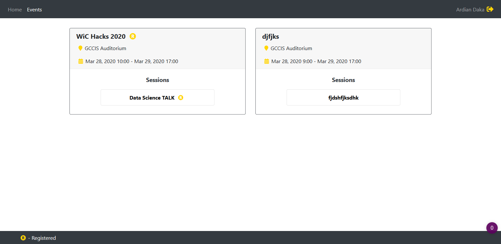
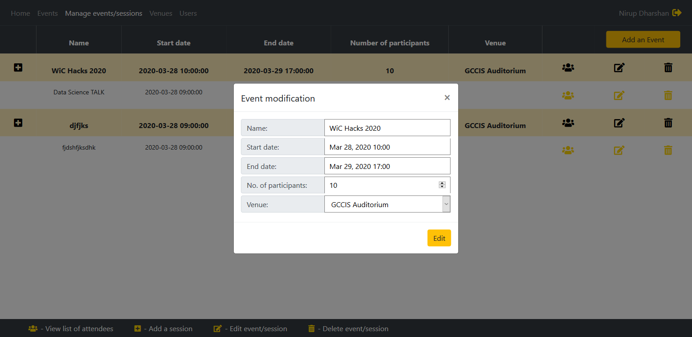

# Event Management System

An event management system developed in PHP: 

The system has four types of users: attendee, event manager, admin and super admin.

An attendee can view and register/unregister for events/sessions:

An event manager has the same priviledges as an attendee, in adittion to performing CRUD operations on events, sessions, venues and list of attendees:

An admin has the same priviledges as an attendee and event manager, in adition to performing CRUD operations on other users (such as modifiying their email address) and changing user roles (except super admin's):

